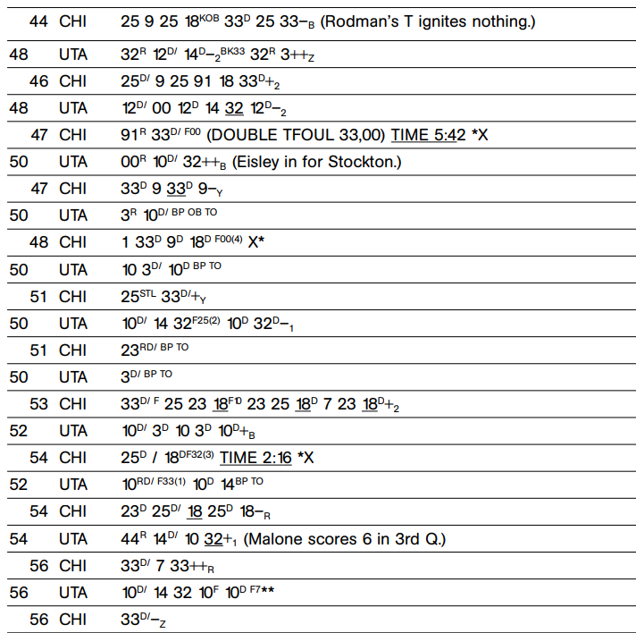

# Thinking Basketball Dean Oliver 2004

## Chapter 1 
Sports in general just provide a more concrete and often more emotional context to experience life.

## Chapter 2
_Watching a Game: Offensive Score Sheets_

Number at the start of the line is the number of point at the end of the possession. The team abbreviationg comes next. This is followed by a sequence of passes, dribbles (denoted superscript D) , rebounds (denoted superscript R), shots (subcscripts indicated where the ball was shot from note the figure above. misses are denoted - makes are denoted +).
* / passes cross court, if in superscript it means dribbles across halfcourt
* ++ denotes made shot on assist
* X missed foul shot
* \* made foul shot
* KICK kick ball
* F in subscript denotes a foul, often folled by jersey number of player who committed the foul and how many fouls they have at the time it was committed.
* underlined number illustrates that the person is posting up
* TIME denoted a timeout was called often followed by how many minutes left
* ROB in superscript means the rebound went out of bounds (somtimes the player who take it out of bounds is tracked with OB)
* TO denoted turnover
* STL denoted steal
* BP denoted bad pass
* KOB denoted knocked out of bounds
* TRVL denotes the player travled
* END followed by note of which quarter it is
* OF denoted iffensive foul
* LB stands for lost ball type of turnover
* TFOUL denoted technical foul
* BK denoted block
* S CK TO denoted shot clock violation (turnover)

The most absic thing to come out of a scoresheet is the concept of a possession. At the end of a gam each team has just about the same possessions (cumulative sum). High energy, run and gun teams have a high possession count at an upward of 100 while walk it up the court, slower teams have around 80.  A good way to approximate possessions:
$$ Poss = FGA - OREB + TOV + 0.4 * FTA $$
A more technical of this formula replaced the OREB with something more complex:
$$ FGA - OREB/OREB + DDREB  * (FGA-FGM) * 1.07+ TOV + 0.4 * FTA $$
It’s easy to calculate how efficient the two teams were with their possessions. e. An efficient offensive team scores more points with its given possessions, not more points overall.
_offensive rating_ --> points scored per 100 possessions
_defensive rating_ --> point allowed per 100 posesisons 
Thinking in terms of possessions and efficiency is the biggest thing that comes out of scoring a game with the score sheet above (Throughout the rest of this book, when a team offense is referred to as good, it is because they are efficient, not because they score a lot of points).
_Points per possession_ can expand thids concept to be applicable to individual players.

